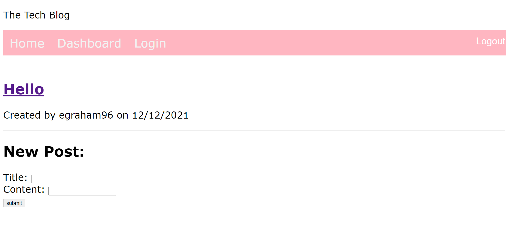

# Homework Assignment 14-TechBlog

## Description:
This week's homework required us to refactor an e-commerce website built with React so that it uses React Redux. It allows the user to create a profile, login, add items to a shopping cart, and purchase items.

## Installation Instructions:
-You can visit this deployed application on Heroku here:

-Alternatively, you can download this repository. Then, navigate to repository directory in your terminal. Install application dependencies with the 'npm install' command and run application with 'npm run develop'. 

## Deployed Links:
* [See Live Site](https://github.com/egraham96/ReduxStore)
* [Link to GitHub Repo](https://github.com/egraham96/ReduxStore)

## Screenshot of Deployed Application: 

## How to Contribute:
If you'd like to contribute to this project please send an email to eeg4@uw.edu or message me on github: egraham96.

## How to Test the Application:
Please see installation instructions above. 

## License:

Copyright <2021><Emma Graham>

Permission is hereby granted, free of charge, to any person obtaining a copy of this software and associated documentation files (the "Software"), to deal in the Software without restriction, including without limitation the rights to use, copy, modify, merge, publish, distribute, sublicense, and/or sell copies of the Software, and to permit persons to whom the Software is furnished to do so, subject to the following conditions:

The above copyright notice and this permission notice shall be included in all copies or substantial portions of the Software.

THE SOFTWARE IS PROVIDED "AS IS", WITHOUT WARRANTY OF ANY KIND, EXPRESS OR IMPLIED, INCLUDING BUT NOT LIMITED TO THE WARRANTIES OF MERCHANTABILITY, FITNESS FOR A PARTICULAR PURPOSE AND NONINFRINGEMENT. IN NO EVENT SHALL THE AUTHORS OR COPYRIGHT HOLDERS BE LIABLE FOR ANY CLAIM, DAMAGES OR OTHER LIABILITY, WHETHER IN AN ACTION OF CONTRACT, TORT OR OTHERWISE, ARISING FROM, OUT OF OR IN CONNECTION WITH THE SOFTWARE OR THE USE OR OTHER DEALINGS IN THE SOFTWARE.

